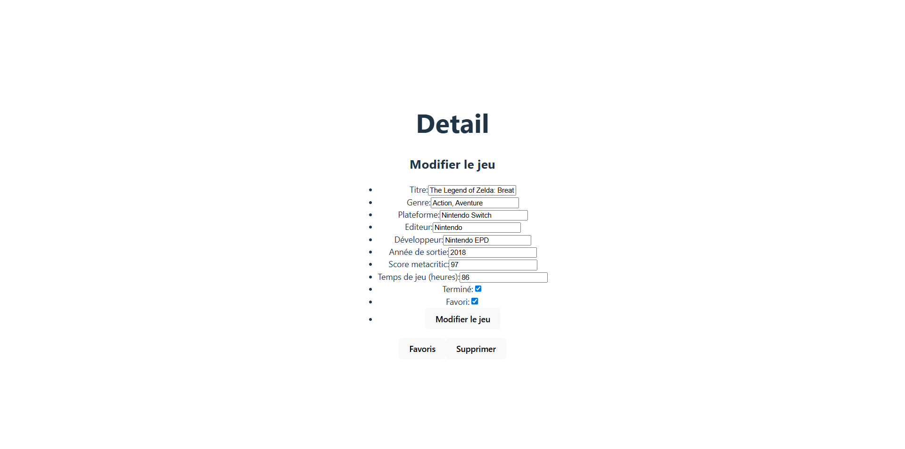

# noSql

## Description

Cette application est un petit projet full-stack NoSQL (MongoDB) composé de trois parties principales :

- `api` : backend Node/Express qui fournit une API REST pour gérer des jeux.
- `front` : interface utilisateur en React + Vite pour consulter, ajouter et modifier des jeux.
- `docs` : contient la documentation et des captures d'écran de l'application (utiles pour la présentation).

Le présent README décrit comment installer et lancer chaque partie, ainsi que l'emplacement des captures d'écran incluses.

## Arborescence importante

- `api/` — code du serveur (Node.js, Express, Mongoose)
- `front/` — application client (React, Vite)
- `docs/` — documentation et captures d'écran (`dashboard.png`, `detail.png`)
- `dbinit.php` — script d'initialisation de base (fichier PHP fourni pour certaines manipulations de base de données)
 - `docs/` — documentation et captures d'écran (`dashboard.png`, `detail.png`)

## Prérequis

- Node.js (version 18+ recommandée)
- npm
- MongoDB accessible (local ou Atlas)

## Configuration

1. Créez un fichier `.env` dans `api/` avec vos variables (par exemple) :

	MONGO_URI=your_mongodb_connection_string
	PORT=3000

2. Si nécessaire, créez un fichier `.env` dans `front/` pour configurer l'URL de l'API (par exemple `VITE_API_URL=http://localhost:3000`).

Remarque : les fichiers `.env` existants peuvent déjà se trouver dans `api/` et `front/` (vérifiez et adaptez les valeurs selon votre environnement).

## Installation et exécution

Instructions rapides (PowerShell / terminal Windows) :

1) Lancer l'API

	cd api
	npm install
	npm run dev    # pour le mode développement (nodemon)
	# ou
	npm start      # pour exécuter une instance Node simple

2) Lancer le front

	cd front
	npm install
	npm run dev    # démarre Vite en mode développement

Une fois l'API et le front démarrés, ouvrez le front (généralement http://localhost:5173 par défaut pour Vite) et utilisez l'application.

## Points utiles dans le dépôt

- Export CSV des jeux : `api/src/export/games_export.csv`
- Contrôleurs API : `api/src/controllers/game.js`
- Modèle Mongoose : `api/src/models/Game.js`
- Routes API : `api/src/routes/game.js`
- Composants React principaux : `front/src/components/` et pages dans `front/src/pages/`

## Captures d'écran

Voici deux captures présentes dans `docs/` montrant l'interface :

Tableau de bord (listing des jeux) :

Détail d'un jeu :

